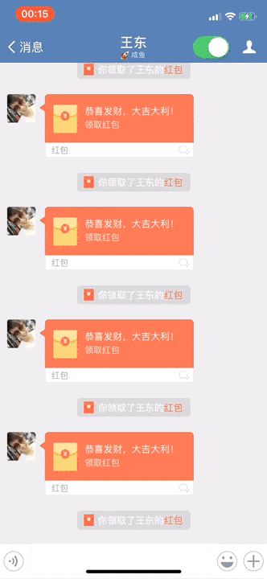

# 免越狱企业微信抢红包功能

写这个，主要是为了：认真工作的时候却错过了老板的红包，心里不爽😂，加上感点兴趣，所以抽时间简单搞了一下

附[MyWeWork_Tweak越狱版](https://github.com/harddog/MyWeWork_Tweak.git)

### 使用
先安装[MonkeyDev](https://github.com/AloneMonkey/MonkeyDev)

###### - 抢红包
1. 将脱壳后的企业微信ipa解压取得.app文件放到`MyWeWork/TargetApp/wework.app`  
2. 安装Xcode，并打开`MyWeWork.xcworkspace`，配置自己的BundleID和证书  
3. 插上手机，`cmd+R`，duang~，运行成功  
4. 功能面板：
    1. <红包开关> 新加了功能面板，摇晃手机展示选择框，将红包开关打开即可自动抢红包（默认打开状态）
    2. <查看红包详情> 抢红包时，点击红包消息是不能进入详情的，可以打开此按钮，来允许进入详情查看红包详情，和红包开关互斥
    3. <打开Debug> 技术人员使用

###### - 编译打包使用
1. 编译Release版`cmd+shift+i`，编译Debug版`cmd+R` 待编译完成 （建议使用debug版本，就不要给人家团队增加线上脏数据了😅）
2. 双击`LatestBuild/createIPA.command`，待进程完成后，文件夹下面会多一个Target.ipa文件，拿去用吧

### 效果
1. 自动打开红包，功能只能在聊天会话页面使用，但是可以在后台，继续抢
2. 旧版本会存在多个红包并发，抢失败的情况，v2.0修复了
3. ~~仔细想了想应该不会封号，还能把你开除企业么？🤔~~

### 注意
1. 非越狱手机推送是不可能推送的，这辈子都不会有推送
2. [砸壳后的企业微信ipa文件_2.3.0](https://pan.baidu.com/s/1pMdeQXP)  密码:owjr，自己可以尝试新版
3. [MyWeWork仓库地址](https://github.com/harddog/MyWeWork)

### 感谢
1. 感谢 [MonkeyDev](https://github.com/AloneMonkey/MonkeyDev)，在没有越狱机的情况下还能简单的调试编写
2. 感谢同事的1分钱测试红包

### 免责声明

**免责声明: 软件仅供技术交流，禁止用于商业及非法用途，如产生法律纠纷与本人无关。**

使用有风险，使用需谨慎。

要使用本插件，请使用者自行承担各种状况。

>简书：<https://www.jianshu.com/u/a0e2f8047033>   
github：<https://github.com/harddog>  

