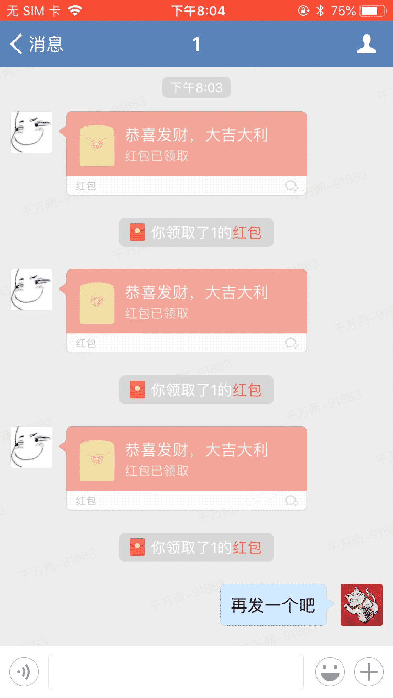

# 免越狱企业微信抢红包功能

写这个，主要是为了：认真工作的时候却错过了老板的红包，心里不爽😂

### 使用
先安装[MonkeyDev](https://github.com/AloneMonkey/MonkeyDev)

###### - 测试使用
1. 将脱壳后的企业微信ipa解压取得.app文件放到`MyWeWork/TargetApp/wework.app`  
2. 选择自己的BundleID和证书  
3. 插上手机，`cmd+R`  
4. 聊天会话页面右上角有个开关，打开后，如果人发红包红包的话，会自动抢（默认打开）  

###### - 正式使用
1. 编译Release版`cmd+shift+i`，待编译完成
2. 双击`LatestBuild/createIPA.command`，待进程完成后，文件夹下面会多一个ipa文件，拿去用吧

### 效果
1. 自动打开红包，功能只能在聊天会话页面使用，但是可以在后台，继续抢
2. 仔细想了想应该不会封号，还能把你开除企业么？🤔 

### 注意
1. 非越狱手机推送是不可能推送的，这辈子都不会有推送
2. [砸壳后的企业微信ipa文件_2.3.0](https://pan.baidu.com/s/1pMdeQXP)  密码:owjr，自己可以尝试新版
3. [MyWeWork仓库地址](https://github.com/harddog/MyWeWork)

### 感谢
1. 感谢 [MonkeyDev](https://github.com/AloneMonkey/MonkeyDev)，在没有越狱机的情况下还能简单的调试编写
2. 感谢同事的1分钱测试红包

### 版权及免责声明
本插件所有代码都由本人完成。

外挂有风险，使用需谨慎。

要使用本插件，请使用者自行承担各种状况。

>简书：<https://www.jianshu.com/u/a0e2f8047033>   
github：<https://github.com/harddog>  
qq: 867129306

